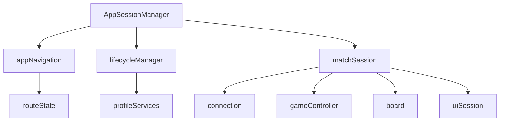

# Unified Refactor Plan: Reliable In-App Home and Session Switching

## Objective

Replace hard page navigation/reload reset paths with deterministic in-app transitions so the app can safely run repeated flows in one browser runtime:

- home -> invite/match -> home -> another invite/match,
- home -> bot/puzzle/snapshot -> home,
- logout/login without reload,
- browser back/forward without route-state drift.

The end result must be equivalent to a fresh `/` load, without depending on full-page reload for correctness.

---

## Scope

## In scope

- Remove normal-flow dependence on `window.location.href = "/"` and `window.location.reload()`.
- Introduce explicit session lifecycle ownership and teardown.
- Make route state dynamic and synchronized with browser history (`popstate`).
- Make board/game/connection/UI transitions idempotent and race-safe.
- Harden auth/profile lifecycle for repeated runtime transitions.
- Add diagnostics and rollout controls for safe production cutover.

## Out of scope (initial refactor)

- Full UI redesign.
- Full app-wide state-management rewrite in one step.
- Backend API changes unless required by discovered correctness gaps.

---

## Mandatory Reliability Outcomes

1. No normal user flow requires reload to restore correct state.
2. Session teardown disposes all match-scoped listeners/subscriptions/timers/RAF.
3. Session setup can run repeatedly without duplicating DOM/listeners/intervals.
4. Stale async callbacks from previous sessions are ignored.
5. URL route and in-memory session state stay synchronized, including back/forward.
6. Logout/login is stable in the same runtime.

---

## Hard Navigation / Reload Call Sites To Replace

- `src/game/gameController.ts`
  - `didClickHomeButton()`
  - `didConfirmRematchProposal()` (non-online branch)
- `src/ui/BottomControls.tsx`
  - `handleCancelAutomatchClick()`
- `src/ui/ProfileSignIn.tsx`
  - `performLogout()` reload completion/error path
- `src/connection/connection.ts`
  - `seeIfFreshlySignedInProfileIsOneOfThePlayers()`
  - `sendMatchUpdate()` error fallback

No new callsites may be introduced during refactor.

---

## Current Constraints To Remove

- Route mode is currently derived from module-load-time values (`initialPath`, `isCreateNewInviteFlow`, `isBoardSnapshotFlow`, `isBotsLoopMode`) and treated as static.
- Session bootstrap includes one-shot assumptions (`initializationRef` / single `go()` paths).
- Session cleanup is partial in key areas (connection observers, board listeners, delayed callbacks).
- Imperative exported setter pattern couples lifecycle to component mount timing.
- Some services/stores keep session-adjacent state without explicit reset ownership.

---

## Target Architecture

## Lifecycle scopes

- **App scope**: app-lifetime listeners, persistent user preferences, asset caches.
- **Match scope**: active invite/match context, game/board runtime, match popups and timers.
- **Profile scope**: identity-dependent caches/services reset on logout/profile switch.

## Orchestrator shape

- Public contract: `src/session/AppSessionManager.ts`
  - `transition(target)`
  - `getCurrentSessionId()`
  - `getCurrentTarget()`
- Internal modules:
  - `src/lifecycle/lifecycleManager.ts`
  - `src/navigation/routeState.ts`
  - `src/navigation/appNavigation.ts`
  - `src/game/matchSession.ts`

---

## Required Contracts (Non-Negotiable)

## 1) Route state contract

- Route mode must be computed from current path at runtime, not static imports.
- Navigation writes (`pushState`/`replaceState`) must be centralized.
- `popstate` must trigger guarded transitions (no recursion loops).

## 2) Teardown ordering contract

Every match exit transition must execute in this order:

1. Close transient UI (popups/overlays/panels/shiny/island/move history).
2. Stop game-controller timers/subscriptions and reset match globals.
3. Stop board listeners/intervals/RAF and clear transient render state.
4. Stop connection observers (match/profile/wager/rematch/invite) and clear active IDs.
5. Reset match/profile-scoped services/stores according to reset policy.

All teardown steps must be idempotent.

## 3) Session epoch/token guard contract

- Increment epoch on session boundary.
- Capture epoch and identity (`inviteId`/`matchId`) at callback registration.
- Apply side effects only if epoch and identity still match active session.
- Drop stale callbacks and log in dev diagnostics.

## 4) Idempotence contract

- `setupBoard()` / `setupGameInfoElements()` must not duplicate DOM or listeners across re-entry.
- Session `dispose` may be called multiple times without errors or leaks.
- Re-entering same/different invite in one runtime must produce clean baseline each time.

## 5) Observability contract

- Maintain dev counters for active observers/listeners/timers/RAF.
- Counters must return to baseline after teardown.

---

## Complete Cleanup Inventory

## A) Connection session ownership (`src/connection/connection.ts`)

Must explicitly own and reset:

- active IDs/state: `inviteId`, `matchId`, `latestInvite`, `myMatch`, invite creation flags,
- identity state: `currentUid`, `loginUid`, same-profile markers,
- observer refs: match/profile/wager/rematch/mining/invite waiters,
- optimistic resolution/session caches tied to active match.

Must provide deterministic API:

- `attachToRoute(...)` / `detachFromMatch(...)` (or equivalent),
- full teardown used by invite switch, home transition, and sign-out.

Required fixes:

- dedupe repeat registration (`observeMatch`/similar),
- guard async `connect/reconnect` and invite-fetch branches with epoch/token checks,
- remove partial-cleanup-only paths.

## B) Game session ownership (`src/game/gameController.ts`)

Reset all match-scoped globals, including:

- mode/lifecycle flags (`isWatchOnly`, `isOnlineGame`, `isGameWithBot`, `puzzleMode`, `isGameOver`, `didConnect`, etc.),
- move processing counters/strings (`whiteProcessedMovesCount`, `blackProcessedMovesCount`, flat move strings),
- game model/session fields (`game`, flashback state, side colors, inputs),
- wager mirrors/animation flags (`currentWagerState`, `wagerMatchId`, outcome animation state),
- reaction/timer caches (`processedVoiceReactions`, timer stashes, bot/reaction timestamps).

Required fixes:

- track every timeout handle and cancel on dispose,
- own wager subscription unsubscribe (no one-way setup flag),
- enforce active-session validation in match update handlers.

## C) Board runtime ownership (`src/game/board.ts`)

Must reset/cleanup:

- board layers/transient DOM refs/highlights/traces/move statuses,
- timer/animation refs (`countdownInterval`, text animation timers, wager RAF, wave/sparkle intervals),
- global listeners created in setup (`document` input listener, `window` resize listener).

Required fixes:

- replace anonymous listener registration with removable handler references,
- track/clear all `addWaves()` intervals,
- ensure setup path is re-entrant without duplicate elements.

## D) UI session state ownership

Must provide deterministic reset for:

- `src/ui/BottomControls.tsx` popups, delayed callbacks, automatch cancel behavior,
- `src/ui/MainMenu.tsx` menu/info/music overlays and transient timers,
- `src/ui/ProfileSignIn.tsx` profile popups/banner/logout transition behavior,
- `src/ui/BoardComponent.tsx` overlay/reaction/wager handler bridges,
- `src/ui/ShinyCard.tsx` explicit hide/cleanup on transitions,
- `src/ui/islandOverlayState.ts` close/finalize path,
- `src/ui/MoveHistoryPopup.tsx` global callback pointers.

Required fixes:

- central "close all transient UI" contract used in every session exit,
- safe defaults when imperative handlers are invoked pre-mount/post-dispose.

## E) Services/stores reset ownership

Match-scope reset required:

- `src/game/wagerState.ts`,
- `src/game/mainGameLoadState.ts` re-entry support,
- `src/services/wagerMaterialsService.ts` active match context.

Profile-scope reset required:

- `src/services/rocksMiningService.ts`,
- `src/services/nftService.ts`,
- `src/utils/playerMetadata.ts`,
- `src/utils/ensResolver.ts` (clear or TTL-based invalidation policy).

App-scope (keep across match exits):

- persisted preferences (`src/utils/storage.ts`, except explicit auth/session keys),
- asset caches (`useEmojis`, `useGameAssets`),
- app-lifetime audio resources (`SoundPlayer`, music policy by UX decision).

---

## File-by-File Execution Checklist

## Core architecture/routing

- [ ] `src/session/AppSessionManager.ts` (new)
- [ ] `src/lifecycle/lifecycleManager.ts` (new)
- [ ] `src/navigation/routeState.ts` (new)
- [ ] `src/navigation/appNavigation.ts` (new)
- [ ] `src/game/matchSession.ts` (new)

## Connection/auth

- [ ] `src/connection/connection.ts`
- [ ] `src/connection/authentication.ts`

## Game/board/stores/services

- [ ] `src/game/gameController.ts`
- [ ] `src/game/board.ts`
- [ ] `src/game/wagerState.ts`
- [ ] `src/game/mainGameLoadState.ts`
- [ ] `src/game/confetti.ts`
- [ ] `src/services/wagerMaterialsService.ts`
- [ ] `src/services/rocksMiningService.ts`
- [ ] `src/services/nftService.ts`
- [ ] `src/utils/playerMetadata.ts`
- [ ] `src/utils/ensResolver.ts`

## UI/session controls

- [ ] `src/ui/BottomControls.tsx`
- [ ] `src/ui/MainMenu.tsx`
- [ ] `src/ui/ProfileSignIn.tsx`
- [ ] `src/ui/BoardComponent.tsx`
- [ ] `src/ui/ShinyCard.tsx`
- [ ] `src/ui/islandOverlayState.ts`
- [ ] `src/ui/MoveHistoryPopup.tsx`
- [ ] `src/index.tsx`

---

## Phased Implementation Plan

## Phase 0 - Instrumentation and safety rails

Tasks:

- Add transition logging (from target -> to target, session ID, epoch).
- Add dev counters for observers/listeners/timers/RAF by scope.
- Add feature controls: `USE_IN_APP_HOME_NAV` and `IN_APP_HOME_DISABLED`.
- Add board setup duplication assertions (dev-only).

Exit criteria:

- Baseline counters visible and stable at startup.

## Phase 1 - Dynamic route state + browser history sync

Tasks:

- Replace static route booleans with runtime route parsing.
- Centralize navigation writes via `appNavigation`.
- Add `popstate` transition handling with recursion guard.

Exit criteria:

- Route mode updates correctly without reload and remains in sync on back/forward.

## Phase 2 - Deterministic teardown APIs

Tasks:

- Implement full teardown for connection/game/board.
- Ensure sign-out path invokes full connection detach.
- Add explicit reset APIs for match/profile-scoped stores/services.
- Fix confetti/listener cleanup.

Exit criteria:

- Teardown called twice remains safe and leak-free.

## Phase 3 - Async race and stale-callback hardening

Tasks:

- Add epoch/token checks to all async boundaries in connection/game/UI callbacks.
- Add observer registration dedupe.
- Guard invite switch/reconnect in-flight async completions.

Exit criteria:

- Rapid transitions do not mutate active session with stale data.

## Phase 4 - Auth/profile lifecycle correctness

Tasks:

- Remove one-shot auth setup assumptions.
- Expose and consume auth unsubscribe cleanup.
- Apply profile-scope reset hooks for identity-dependent services/caches.

Exit criteria:

- repeated logout/login works in same runtime with clean state.

## Phase 5 - Soft-home transition rollout (flagged)

Tasks:

- Implement `transition({ mode: "home" })` using teardown ordering contract.
- Replace all listed hard navigation/reload callsites with orchestrated transition.
- Keep legacy fallback behind flags until release gate passes.

Exit criteria:

- Home transition is in-app and behavior-equivalent to fresh home baseline.

## Phase 6 - UI bridge normalization

Tasks:

- Replace mutable exported setter bridge with centralized session UI service/store.
- Preserve compatibility shim during migration, then remove.
- Ensure all transient popups/overlays share deterministic reset path.

Exit criteria:

- session logic no longer relies on stale imperative callbacks.

## Phase 7 - Cleanup and default-on cutover

Tasks:

- remove dead compatibility paths,
- finalize lifecycle ownership documentation,
- keep kill switch for one stable release cycle.

Exit criteria:

- no hidden reload dependency remains in normal runtime flows.

---

## PR Breakdown (Recommended)

1. Orchestrator/routing foundations.
2. Connection teardown/sign-out hardening.
3. Board teardown/idempotence.
4. Game reset/store lifecycle.
5. Async epoch guard rollout.
6. Soft-home callsite migration (flagged).
7. Auth/profile hardening + final cleanup.

---

## Rollout Controls

- `USE_IN_APP_HOME_NAV` default `off` until validation gate passes.
- staged rollout: local -> staging -> canary -> full.
- `IN_APP_HOME_DISABLED` emergency rollback control must remain available through stabilization period.

---

## Validation Matrix (Must Pass Before Default-On)

## Core transitions

1. Home -> invite/match -> home.
2. Home -> automatch -> cancel -> home.
3. Home -> bot -> home.
4. Home -> puzzle -> home.
5. Snapshot URL -> home.
6. Watch-only -> authenticated takeover path -> home.

## Stress scenarios

1. Rapid invite switch (`A -> B -> home -> C`) with no stale updates.
2. Transition home while async work is in flight (wager updates, timer callbacks, bot delays).
3. Repeated loop >= 10 cycles (`match -> home -> match`) with stable counters.
4. Browser back/forward across invite/home/match.
5. Logout/login repetition without reload.

## Regression checks

- rematch flow still works,
- wager proposal/accept/decline/cancel correctness,
- mining material display correctness after transitions,
- no duplicate board DOM/waves/listeners after repeated re-entry,
- no session bleed in timers/reactions/avatars/popups.

---

## Risks and Mitigations

- **Stale async callbacks mutate new session**
  - Mitigate with epoch + identity guards at every async boundary.
- **Partial cleanup leaves observers active**
  - Mitigate with single teardown entrypoint + counter-based assertions.
- **Board setup duplication on re-entry**
  - Mitigate with idempotent setup contract and teardown-first re-init.
- **Auth/profile desynchronization after no-reload transitions**
  - Mitigate with reactive auth lifecycle and profile-scope reset hooks.
- **UI bridge race conditions**
  - Mitigate with centralized transient UI reset and migration away from mutable exported callbacks.

---

## Backend Impact

- No mandatory backend changes required for this refactor.
- Optional future enhancement: richer error payloads for better client retry decisions.

---

## Definition of Done

- No normal flow depends on page reload/navigation reset.
- Home transition is fully in-app, deterministic, and idempotent.
- Session teardown reliably returns diagnostic counters to baseline.
- Route state stays synchronized with history navigation.
- Repeated match/home and logout/login cycles are stable in one runtime.
- All checklist items are complete and validation matrix passes.

